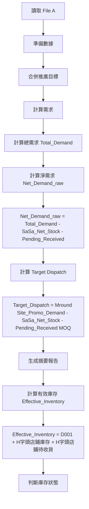

# 店舖存貨計算分析報告

## 問題 1

在計算店舖存貨時，是否有考慮到店舖的實際庫存及在途貨品？
- 實際庫存 = SaSa Net Stock
- 在途貨品 = Pending Received

## 答案 1

**是的，系統已正確考慮店舖的實際庫存（SaSa Net Stock）和在途貨品（Pending Received）。**

---

## 問題 2

計算 Target 時，是否有按照以下公式計算？
```
Target Qty * Shop Target(%) / Promotion Days * Target Cover Days
```

## 答案 2

**否，系統目前沒有按照此公式計算 Target。**

### Site_Promo_Demand 實際計算公式

程式碼中的 `Site_Promo_Demand` 計算（位於 [`promo_calculator.py:478-483`](promo_calculator.py:478-483)）：

```python
# Promotion Demand
out["Site_Promo_Demand"] = 0.0
promo_mask = out["Is_Promo_SKU"]
out.loc[promo_mask, "Site_Promo_Demand"] = (
    out.loc[promo_mask, "SKU_Target"] * out.loc[promo_mask, "Site_Target_%"]
)
```

**實際公式：**
```
Site_Promo_Demand = SKU_Target × Site_Target_%
```

### 公式對比

| 項目 | 程式碼實際計算 | 預期公式 |
|------|----------------|------------------|
| **公式** | `SKU_Target × Site_Target_%` | `Target Qty × Shop Target(%) / Promotion Days × Target Cover Days` |
| **是否考慮 Promotion Days** | ❌ 否 | ✅ 是 |
| **是否考慮 Target Cover Days** | ❌ 否 | ✅ 是 |
| **計算結果** | 直接分配給店舖的目標量 | 根據推廣天數和覆蓋天數調整後的目標量 |

### 影響分析

由於 `Site_Promo_Demand` 用於以下計算：

1. **Total_Demand**（第 486 行）：
   ```python
   out["Total_Demand"] = out["Base_Demand"] + out["Site_Promo_Demand"]
   ```

2. **Target_Dispatch**（第 611-642 行）：
   ```python
   raw_value = site_promo_demand - sasa_net_stock - pending_received
   ```

3. **Suggested_Dispatch_Qty**（ND 站點，第 548-573 行）：
   ```python
   result = math.ceil(target / moq) * moq
   ```

因此，`Site_Promo_Demand` 的計算方式會直接影響：
- 總需求量
- Target Dispatch 量
- ND 站點的派貨建議量

### 建議

如果業務邏輯需要考慮 Promotion Days 和 Target Cover Days，建議修改 [`calculate_demand()`](promo_calculator.py:452-867) 函數中的 Site_Promo_Demand 計算邏輯。

---

## 詳細分析

### 1. 資料來源

系統從 File A（庫存數據文件）讀取以下欄位：

| 欄位名稱 | Config 中的定義 | 說明 |
|---------|----------------|------|
| Article | `COL_A_ARTICLE = "Article"` | 產品編碼 |
| Site | `COL_A_SITE = "Site"` | 門市代碼 |
| SaSa Net Stock | `COL_A_NET_STOCK = "SaSa Net Stock"` | 實際庫存 |
| Pending Received | `COL_A_PENDING = "Pending Received"` | 在途貨品 |

### 2. 淨需求計算（Net_Demand_raw）

在 [`promo_calculator.py`](promo_calculator.py:489-492) 的 [`calculate_demand()`](promo_calculator.py:452-867) 函數中：

```python
# Net_Demand_raw (without Safety Stock)
out["Net_Demand_raw"] = (
    out["Total_Demand"]
    - (out["SaSa_Net_Stock"] + out["Pending_Received"])
)
```

**公式說明：**
- `Net_Demand_raw = Total_Demand - (SaSa_Net_Stock + Pending_Received)`
- 系統將總需求減去實際庫存和在途貨品的總和
- 這確保了派貨量不會超過實際需求

### 3. Target Dispatch 計算

在 [`promo_calculator.py`](promo_calculator.py:610-644) 的 [`compute_target_dispatch()`](promo_calculator.py:611-642) 函數中：

```python
# 計算店舖推廣目標需求量 - SaSa Net Stock - Pending Received
raw_value = site_promo_demand - sasa_net_stock - pending_received

# 使用 Mround (四捨五入到最接近的 MOQ 倍數)
result = round(raw_value / moq) * moq
```

**公式說明：**
- `Target_Dispatch = Mround((Site_Promo_Demand - SaSa_Net_Stock - Pending_Received), MOQ)`
- 基於推廣目標需求量計算派貨量
- 同樣扣除了實際庫存和在途貨品
- 使用 Mround 函數四捨五入到最接近的 MOQ 倍數

### 4. 有效庫存計算（Effective_Inventory）

在 [`promo_calculator.py`](promo_calculator.py:969-1030) 的 [`generate_summary()`](promo_calculator.py:870-1127) 函數中：

```python
# 有效庫存 = D001 + H字頭店鋪庫存 + H字頭店鋪待收貨
effective_inventory = row["D001_SaSa_Net_Stock"] + h_stock + h_pending
```

**公式說明：**
- `Effective_Inventory = D001_SaSa_Net_Stock + H字頭店鋪_SaSa_Net_Stock + H字頭店鋪_Pending_Received`
- H字頭店鋪包括 HA*、HB*、HC*、HD* 開頭的門市代碼
- 用於判斷整體庫存狀態

### 5. 庫存狀態判斷

系統根據有效庫存和總需求判斷庫存狀態：

**當 Supply source 為 2 時：**
- 如果 `Total_Demand ≤ Effective_Inventory` 且 `D001_SaSa_Net_Stock > 100`：
  - 狀態：庫存足夠, RP team會安排Lot For Lot
- 如果 `Total_Demand ≤ Effective_Inventory` 但 `D001_SaSa_Net_Stock < 100`：
  - 狀態：庫存足夠目標數量, 但D001少於100件, 在需要時進行搓貨
- 如果 `Total_Demand > Effective_Inventory`：
  - 狀態：庫存不足夠, 請Buyer留意

**當 Supply source 為 1 或 4 時：**
- 如果 `Total_Demand ≤ Effective_Inventory`：
  - 狀態：庫存足夠
- 如果 `Total_Demand > Effective_Inventory`：
  - 狀態：庫存不足夠, 請Buyer開PO

---

## 計算流程圖



---

## 關鍵計算位置

### 位置 1：Net_Demand_raw 計算
**檔案：** [`promo_calculator.py`](promo_calculator.py:489-492)
**函數：** [`calculate_demand()`](promo_calculator.py:452-867)
**行數：** 489-492

```python
out["Net_Demand_raw"] = (
    out["Total_Demand"]
    - (out["SaSa_Net_Stock"] + out["Pending_Received"])
)
```

### 位置 2：Target Dispatch 計算
**檔案：** [`promo_calculator.py`](promo_calculator.py:610-644)
**函數：** [`compute_target_dispatch()`](promo_calculator.py:611-642)
**行數：** 628-642

```python
# 計算店舖推廣目標需求量 - SaSa Net Stock - Pending Received
raw_value = site_promo_demand - sasa_net_stock - pending_received

# 如果結果 <= 0 或 MOQ <= 0，則不需要派貨
if raw_value <= 0 or moq <= 0:
    return 0

# 使用 Mround (四捨五入到最接近的 MOQ 倍數)
result = round(raw_value / moq) * moq

# 確保結果不小於 MOQ
result = max(result, moq)

return int(result)
```

### 位置 3：有效庫存計算
**檔案：** [`promo_calculator.py`](promo_calculator.py:969-1030)
**函數：** [`generate_summary()`](promo_calculator.py:870-1127)
**行數：** 976-984

```python
# H-site店鋪的庫存 (HA*, HB*, HC*, HD*)
h_sites = article_detail[article_detail["Site"].str.match(r"^H[ABCD]", na=False)]
h_stock = h_sites["SaSa_Net_Stock"].sum()
h_pending = h_sites["Pending_Received"].sum()

# 有效庫存 = D001 + H字頭店鋪庫存 + H字頭店鋪待收貨
effective_inventory = row["D001_SaSa_Net_Stock"] + h_stock + h_pending
```

---

## 測試驗證建議

為了驗證系統正確性，建議創建以下測試場景：

### 測試場景 1：庫存充足情況
- **設定：** SaSa Net Stock = 100, Pending Received = 10, Total_Demand = 80
- **預期：** Net_Demand_raw = 80 - (100 + 10) = -30，派貨量為 0

### 測試場景 2：庫存不足情況
- **設定：** SaSa Net Stock = 20, Pending Received = 5, Total_Demand = 100
- **預期：** Net_Demand_raw = 100 - (20 + 5) = 75，派貨量 > 0

### 測試場景 3：Target Dispatch 計算
- **設定：** Site_Promo_Demand = 50, SaSa Net Stock = 20, Pending Received = 10, MOQ = 10
- **預期：** Target_Dispatch = Mround(50 - 20 - 10, 10) = Mround(20, 10) = 20

---

## 結論

系統在多個關鍵計算中都正確考慮了店舖的實際庫存（SaSa Net Stock）和在途貨品（Pending Received）：

1. ✓ **淨需求計算**：扣除了實際庫存和在途貨品
2. ✓ **Target Dispatch 計算**：扣除了實際庫存和在途貨品
3. ✓ **有效庫存計算**：包含了 D001 和 H 字頭店鋪的庫存及在途貨品
4. ✓ **庫存狀態判斷**：基於有效庫存進行判斷

這確保了派貨建議的準確性，避免了過度派貨或庫存不足的情況。

---

## 參考文檔

- 程式說明文檔：[`程式說明文檔.md`](程式說明文檔.md)
- 主程式檔案：[`promo_calculator.py`](promo_calculator.py)
- 測試檔案：[`test_inventory_logic.py`](test_inventory_logic.py)
